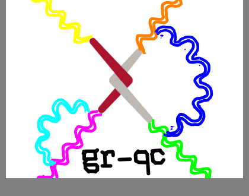
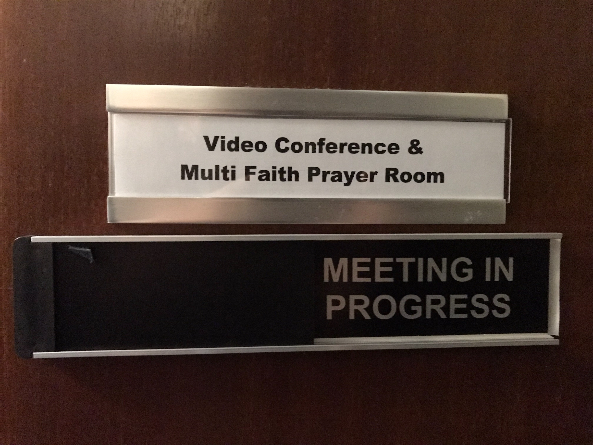

<body class="sph7">
<h2>General relativity and quantum cosmology international journal club</h2>

A scrolling club for the general relativity and quantum cosmology <tt>[gr-qc]</tt> sub-arXiv.

This is a joint initiative between the Central European Institute for Cosmology (CEICO), Institute of Physics of the Czech Academy of Sciences, Observatoire astronomique de Strasbourg, the University of Gdańsk, and the University of Cambridge.

The following, informal algorithm has been shown to work with similar arXiv clubs. The host screen-shares and scrolls slowly through all submissions (gr-qc and cross-list) since the last meeting. The attendees request numbers, whose abstracts are sequestered in new tabs. At the end of each day’s submissions, the tabs are reviewed. Whomever requested the abstract is obliged to lead the discussion. The discussion may even consist of just asking “Does anyone know what \(X\) means?”, i.e. it should be student-friendly. In interesting cases, the discussion may lead to the preprint being opened. Keep an eye on the clock, you need to get through a whole week in about an hour!

Time: 15:30—17:00 GMT /BST or 16:30-17:00 CET /CEST on Thursdays.

<h3>Online venue:</h3>

<ol>
<li><b>Topic:</b> arXiv:Scrolling.Club [gr-qc]</li>
<li><b>Join Zoom Meeting:</b> <a href="https://ucph-ku.zoom.us/j/62879628973?pwd=cWJhdkxOSWI0dFBqSk9aeGR4NGhJZz09">ucph-ku.zoom.us/j/62879628973?pwd=cWJhdkxOSWI0dFBqSk9aeGR4NGhJZz09</a></li>
<li><b>Meeting ID:</b> 628 7962 8973</li>
<li><b>Passcode:</b> gravity</li>
</ol>

<h3>In-person venue:</h3>

<ol>
<li><b>Strasbourg:</b> meeting room of the East Building</li>
<li><b>Cambridge:</b> prayer room in the IoA</li>
<li><b>Gdańsk:</b> Tom's office</li>
</ol>

<h2>Hills Coffee Talks</h2>

The <a href="https://www.astro.phy.cam.ac.uk/">Cavendish Astrophysics Group</a> at the <a href="https://www.astro.phy.cam.ac.uk/about/directions-and-contacts/getting-here">Battcock Centre for Experimental Astrophysics</a>, jointly with the <a href="https://www.ast.cam.ac.uk/">Institute of Astronomy (I.o.A)</a> and <a href="https://www.kicc.cam.ac.uk/">Kavli Institute for Cosmology, Cambridge (KICC)</a>, holds an informal seminar series at 11:15 UK time on Tuesday mornings, (mostly) during term time. By default, content is delivered in person by AP group students and researchers, the idea being to create a kind of "preprint server" for those of us who have more formal seminars and conference talks in their future lightcone. You can present anything, even just an exciting plot. For the time being, we will maintain a hybrid functionality with <a href="https://us06web.zoom.us/j/85869128705?pwd=cXFOZHpMQnluMmJXMllCL0hOMEtndz09">this Zoom room</a> (all welcome, from any institution), but most of us will be gathered in the first-floor coffee area of the Battcock. Doughnuts will be provided.

Beginning in the fall of 2022, these talks (which were previously known as "Battcock coffee/doughnut seminars") have returned as the "Hills Coffee Talks" in honour of our late colleague <a href="https://en.wikipedia.org/wiki/Richard_Edwin_Hills">Richard Hills</a>.

Below you can find our schedule. We are in the process of establishing a sign-up web-page within our intranet. For now, please email me.

<iframe src="https://docs.google.com/spreadsheets/d/e/2PACX-1vQLrw6hp-qA9nrMdfSM7z7VDZL17KhrPlEdUp8Bfn8puVqk5xWeYhRWXNP-PhNz0Cf-vSXY5YHQ65JW/pubhtml?widget=true&amp;headers=false" width="700" height="4500"></iframe>
</body>
