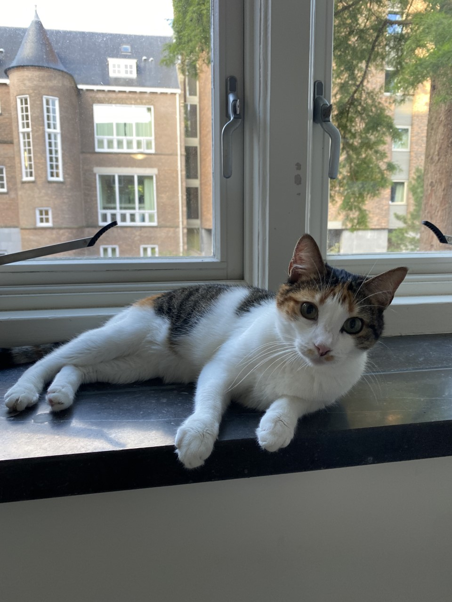

<head>

</head>
<h2>
Welcome!
</h2>

    I'm a theoretical cosmologist at the <a href="https://www.kicc.cam.ac.uk/">Kavli Institute for Cosmology, Cambridge (KICC)</a>, and the <a href="https://www.astro.phy.cam.ac.uk/">Cavendish Laboratory Astrophysics Group</a> at the University of Cambridge. My research is focused on gravitational theory and quantum gravity, including modifications to Einstein's general theory of relativity. 

I'm currently the Rosamund Chambers Junior Research Fellow in Astrophysics at Girton College, Cambridge. I was based at Wolfson College for my Ph.D., and Queens' College for my undergraduate and master's in (physical) Natural Sciences. I grew up in Cornwall, which is the south-western tip of England.

At the moment I'm dividing my time between Cambridge and the <a href="https://www.lorentz.leidenuniv.nl/">Lorentz Institute</a> at Leiden University. I also work with researchers at <a href="https://ceico.cz/">CEICO</a> in Prague.

The colourful image behind this text (courtesy of the ESA and Planck Collaboration) shows the polarised microwave sky, as dominated by the magnetised, dusty foreground of the milky way which lies along the equatorial plane. Behind it lies the fainter cosmic microwave background (CMB), a far more interesting signal from the early Universe and one of the very few ways we have to observationally test quantum gravity.

This site is still very much under construction so I apologise for all glitches! If you want to get in touch, feel free to drop me an email. Unfortunately, I don't use social media.

{{ site.name }}
<h2>
Contact and quick links
</h2>
<table class="table-no-padding">
<tr>
<td rowspan="3" >Email</td>
<td><a href="mailto:wb263@cam.ac.uk">wb263@cam.ac.uk</a></td>
</tr>
<tr>
<td><a href="mailto:wb263@mrao.cam.ac.uk">wb263@mrao.cam.ac.uk</a></td>
<td style="horizontal-align: left">&larr; <em>should redirect</em> &#10548; </td>
</tr>
<tr>
<td><a href="mailto:barker@lorentz.leidenuniv.nl">barker@lorentz.leidenuniv.nl</a></td>
<td style="horizontal-align: left">&larr; <em>should also redirect</em> &#10548; </td>
</tr>
<tr>
<td>Mobile</td>
<td>+44&mdash;(0)7396&mdash;130513</td>
</tr>
<tr>
<td>Office</td>
<td>+44&mdash;(0)1223&mdash;746437</td>
<td style="horizontal-align: left">&larr; <em>not during pandemic</em></td>
</tr>
<tr>
<td>GitHub</td>
<td><a href="https://github.com/wevbarker">wevbarker</a></td>
</tr>
<tr>
<td>arXiv</td>
<td><a href="https://arxiv.org/a/barker_w_1">barker_w_1</a></td>
</tr>
<tr>
<td>ORCiD</td>
<td>
<a href="https://orcid.org/0000-0002-1501-3221">0000-0002-1501-3221</a>
</td>
</tr>
<tr>
<td>Inspire HEP</td>
<td>
<a href="https://inspirehep.net/authors/1839147?ui-citation-summary=true">W.E.V.Barker.2</a>
</td>
<td style="horizontal-align: left">&larr; <em>chronically incomplete</em></td>
</tr>
<tr>
<td>NASA ADS</td>
<td>
<a href="https://ui.adsabs.harvard.edu/search/q=author%3A%22barker%2C%20w.%22&sort=date%20desc%2C%20bibcode%20desc&p_=0">barker, w.</a>
</td>
<td style="horizontal-align: left">&larr; <em>even worse than iNSPIRE</em></td>
</tr>
<tr>
<td>Skype</td>
<td>live:1e38761e619188ae</td>
</tr>
<tr>
<td>Website</td>
<td><a href="http://www.wevbarker.com">wevbarker.com</a></td>
</tr>
<tr>
<td rowspan="3" style="vertical-align: center;">Address</td>
<td>
K34, Kavli Institute for Cosmology 
Madingley Road, Cambridge 
CB3 0HA, United Kingdom
</td>
<td style="vertical-align: center; horizontal-align: left;">&larr; <em>not during pandemic</em></td>
</tr>
<tr>
<td>
233, Instituut-Lorentz voor Theoretische Fysica  
Niels Bohrweg 2, Leiden 
NL-2333 CA, The Netherlands
</td>
<td style="vertical-align: center; horizontal-align: left;">&larr; <em>not during pandemic</em></td>
</tr>
</table>

