<body class="sph5">
<h1>
Resources
</h1>
The plan (for the moment) is that together with co-supervisors <a href="https://yallup.github.io/">Dr. Yallup</a> and <a href="https://www.fzu.cz/en/people/amel-durakovic-phd">Dr. Durakovic</a>, I will leave in this section resources (mostly as links, but perhaps with some downloadable content) which are mentioned during our meetings.
<h3>
Theoretician's toolbox
</h3>
There is some computational infrastructure that you will want to establish, for all the projects and to varying degrees. The sooner you can get this over with, the better!
<h4>
<tt>LaTeX2e</tt>
</h4>
<ol>
<li>I would <b>strongly advise</b> you to write your \(\LaTeX\) report, and your notes, using the <a href="https://journals.aps.org/revtex"><tt>REVTeX 4.2e</tt></a> class. What is it? In their own words: "<i><tt>REVTeX 4.2</tt> is a set of macro packages designed to be used with <tt>LaTeX2e</tt> and is well-suited for preparing manuscripts for submission to the journals of the American Physical Society (APS) and American Institute of Physics (AIP)</i>". Generally speaking, APS journals are the superior category of journals, though there are some other good ones associated with other continents. Try to keep to double-column format wherever you can.</li>
<li>If you wish to compile locally, I would recommend using <a href="https://www.tug.org/texlive/"><tt>TeX Live</tt></a> and <a href="https://ctan.org/pkg/latexmk?lang=en"><tt>latexmk</tt></a> from within terminal. If you prefer a browser, use <a href="https://www.overleaf.com/">Overleaf</a>, which is (sadly) becoming more and more popular. As students, you may be able to <a href="https://www.overleaf.com/edu/cambridge">get Overleaf Professional features</a> by linking with your CRSID.</li>
<li>There is a well defined standard for the inclusion of code in scientific papers. To understand this, look into (and use) the <a href="https://ctan.org/pkg/listings?lang=en"><tt>listings</tt></a> package in your \(\LaTeX\) source.</li>
</ol>

I've prepared a more in-depth template for use in the final reports. You can download the <a href="/assets/mastersprojects/masters-projects/TeXTemplate/PartIIIProjectTemplate.tex" download><button type="button">main .tex file</button></a>, the <a href="/assets/mastersprojects/masters-projects/TeXTemplate/PartIIIProjectTemplateMacros.tex" download><button type="button">.tex file for macros</button></a>, and the <a href="/assets/mastersprojects/masters-projects/TeXTemplate/PartIIIProjectTemplate.bib" download><button type="button">.bib file</button></a>. This template is not a style class, but a working setup which has been carefully tuned to emulate the style of a <i>published</i> APS manuscript.

 

<b><i><u>You do not need to use the template if you enjoy typesetting and have already put a lot of love and care into your \(\LaTeX\) ecosystem.</u></i></b> However, please at least read the text of the pdf so as to pre-empt a lot of avoidable/repetitive editing when the time comes for me to read your report. If you don't like the conventions or have some improvements, let me know!

<h4>
<tt>Git</tt>
</h4>
<ol>
<li>As your project develops (computational projects, or those who are compiling \(\LaTeX\) locally), I would <b>strongly recommend</b> you to use <a href="https://git-scm.com/"><tt>Git</tt></a> and <a href="https://github.com/">Github</a> to version-control and share it, so that I/we can look at your work. For those not acquainted with the terminal, git can be an awkward learning curve, but the rewards are life-changing. There are many great introductions to git on the internet.</li>
</ol>
<h4>
<tt>Mathematica</tt>
</h4>
<ol>
<li>You can get a license e.g. <a href="http://www.cta.phy.cam.ac.uk/software/">here</a>. All Cambridge University students are entitled to a license, if you are encountering any bureaucratic difficulties in this regard, <a href="mailto:wb263@cam.ac.uk">email me</a>.</li>
</ol>
<h4>
<tt>Maple</tt>
</h4>
<ol>
<li>Maple is another body of proprietary computer algebra software. There is no University-wide license for this, but if you really (<i>really</i>) want to try it then <a href="mailto:wb263@cam.ac.uk">email me</a> and we can discuss.</li>
</ol>
<h4>
<tt>xAct</tt>
</h4>
<ol>
<li>For abstract (and component) tensor and spinor calculus (actually for most physically motivated representations of the Lorentz group), use <a href="http://www.xact.es/"><tt>xAct</tt></a>.</li>
<li>For help with xAct, <a href="mailto:wb263@cam.ac.uk">email me</a>, or try the <a href="https://groups.google.com/g/xAct">xAct Group</a>. The latter is actually very responsive, so don't be afraid to try!</li>
<li>There are some great resources and example code for xAct in <a href="https://github.com/xAct-contrib/examples">this Git repository</a>.</li>
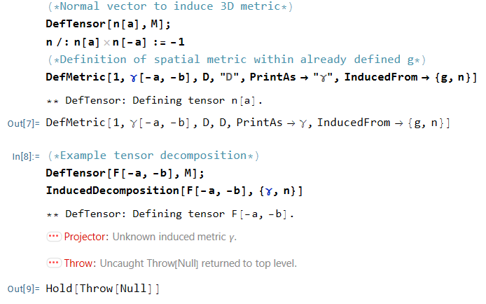
<li>
Some lessons learned from a notebook that was throwing an error (see right).
Firstly, you will almost <b>never</b> need to use <tt>TagSetDelayed</tt>, as below:
<pre>
<code>n /: n[a] n[-a] := -1</code>
</pre>
Instead, it is better to use <tt>MakeRule</tt> and <tt>AutomaticRules</tt> as per:
<pre>
<code>
AutomaticRules[n,MakeRule[{n[a] n[-a],-1},MetricOn->All,ContractMetrics->True]];
</code>
</pre>
This may seem long-winded, but it is much safer when extending to general indices! Next, the syntax for <tt>DefMetric</tt> is not quite right. It takes some close attention to the documentation, but you need a tuple to define the pre- and post-fix covariant derivative notation:
<pre>
<code>
DefMetric[1, \[Gamma][-a, -b], D, {";","D"}, PrintAs -> "\[Gamma]", InducedFrom -> {g, n}]
</code>
</pre>
</li>
<li>If you define a scalar such as <tt>Phi[]</tt>, i.e. call <tt>DefTensor</tt> without index specifications, you must <b>still</b> use the empty square brackets whenever you use your scalar in a tensor expression. There may be some rare scenarios where you will wish to refer to the <tt>xTensor</tt> head directly.</li>
<li>Likewise, covariant derivatives <b>always</b> have the structure <tt>CovD_[Indices__]@xTensor_</tt>, and you must remember both the indices and the action on some tensor expression (expressed either using <tt>@</tt> or <tt>[]</tt>).</li>
<li>A very useful set of tools is provided by the <a href="http://www.xact.es/xtras/">xTras</a> package. This is oriented towards field theory. In particular, if you have a complicated expression and <tt>ToCanonical</tt> is not properly sweeping up all constant symbols into prefactors of unique tensor terms, you should try the <tt>CollectTensors</tt> function.</li>
<li>After a time, the question naturally comes as "<b>How can I better format my tensor head?</b>" The route here is provided by the <tt>PrintAs</tt> option. This function will allow you to effectively parse any string for formatting purposes. Want an accent and superscript on your tensor name? No problem!</li>
<pre>
<code>
DefTensor[NicelyFormattedTensor[-a,b],M4,PrintAs->"\!\(\*SuperscriptBox[OverscriptBox[\(\[ScriptCapitalP]\),\(^\)],\\(\[UpTee]\)]\)"];
</code>
</pre>
</ol>
<h3>
Nested Sampling (NS)
</h3>
<ol>
<li>Nested Sampling is a numerical integration algorithm whose development has been driven in large part by our group here in Cambridge. Whilst it is a general numerical technique it has become synonymous with calculation of Bayesian <i>evidences</i>. An excellent introduction into what evidences are and why they are interesting can be found in the incomparable textbook on inference by David Mackay <a href="http://www.inference.org.uk/mackay/itila/">inference.org.uk</a>. Two specific chapters to read are 28 - the "why" behind model comparison, and 29 - the "how" numerical evaluation of Bayesian inference takes place. This book predates Nested Sampling, but it is hard to look past Mackay when it comes to introducing the lineage of the technique.</li>
<li>The canonical reference for NS is still the original paper by John Skilling available at <a href="https://projecteuclid.org/journals/bayesian-analysis/volume-1/issue-4/Nested-sampling-for-general-Bayesian-computation/10.1214/06-BA127.full">projecteuclid.org</a>. Whilst this remains a source of inspiration for the NS developer, a more modern community review article has been compiled recently that is perhaps a better starting point <a href="https://arxiv.org/abs/2205.15570">arXiv:2205.15570</a>. This review does a good job of establishing the provenance of the technique in fundamental physics, the pointers towards NS as a partition function calculator is perhaps of most interest to readers of this page.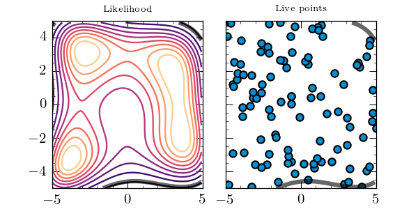</li>
<li> Our group has contributed heavily to the technical landscape of NS. MultiNest <a href="https://arxiv.org/abs/0809.3437">arXiv:0809.3437</a> is a pillar of the NS community, often synonymous with the technique itself -- sampling from contracting ellipsoids is pleasingly intuitively geometric -- and for many years was the most complete and popular implementation of NS. PolyChord is the groups current focus in terms of development, being a "next generation" NS algorithm, specifically aiming to push NS to higher dimensional applications than previously considered. The repository of PolyChord <a href="https://github.com/PolyChord/PolyChordLite">git:PolyChordLite</a> is a good starting point with example code to get a hands on sense. NS is nothing without an analysis built on top of it, and the python package anesthetic <a href="https://github.com/williamjameshandley/anesthetic">git:anesthetic</a> is what we use to drive a lot of our work, again the code repository contains some useful starting worked examples.</li>
</ol>
<h3>
Modified Newtonian Dynamics (MoND)
</h3>
<ol>
<li>Introduction to the specific new relativistic MoND (RMoND) addressed by this project <a href="https://arxiv.org/abs/2007.00082">arXiv:2007.00082</a>.</li>
<li>Quite an old study of the spherically-symmetric field equations of a Tensor-Vector-Scalar (TeVeS) theory <a href="https://arxiv.org/abs/gr-qc/0502122">arXiv:0502122</a>.</li>
<li>McVittie by Kaloper (black holes embedded in FRW spacetimes) <a href="https://arxiv.org/abs/1003.4777">arXiv:1003.4777</a>.</li>
<li>Reduced Lagrangia in highly symmetric spacetimes, and dangers of abbreviating the path integral, are discussed in <a href="https://arxiv.org/abs/1811.10291">arXiv:1811.10291</a> and references therein.</li>
<li>Various other recorded talks to be shared by email, with one embedded below.</li>
<iframe width="100%" height="415" src="https://www.youtube.com/embed/zvXvB55xnSw" title="YouTube video player" frameborder="0" allow="accelerometer; autoplay; clipboard-write; encrypted-media; gyroscope; picture-in-picture" allowfullscreen></iframe>
<li>The MoND project is the only one for which <tt>xCoba</tt> is likely to be very useful. Unhappily, the <tt>xCoba</tt> documentation is pretty shaky, and the paucity of knowledge I have about it is mostly patched together from forums and bit-rotted notebooks (credit to those who post and reply!). Below is a sloppy walkthrough of a script which obtains the so-called <i>minisuperspace</i> equations on the cosmological FLRW background, for the CTEG theory. The script itself can be found in the section on cosmological perturbation theory, and you should be able to edit it to investigate the spherically symmetric spacetime relevant to the MoND project.</li>
<iframe width="100%" height="415" src="https://www.youtube.com/embed/exA1KVZ9vQI" title="YouTube video player" frameborder="0" allow="accelerometer; autoplay; clipboard-write; encrypted-media; gyroscope; picture-in-picture; web-share" allowfullscreen></iframe>
<li>In this script, you can find some tools for extracting the modified spherically symmetric field equations. In particular you will need to implement a unit-timelike one-form field with spherical symmetry. You can do this with the command:
<pre>
<code>
DefScalarFunction[A1,PrintAs->"\[CapitalPhi]"];
DefScalarFunction[A2,PrintAs->"\[CapitalPsi]"];
AllComponentValues[A[{-a,-SphericalPolar}],{A1[cr[]],B2[cr[]]*Sqrt[A1[cr[]]^2/B1[cr[]]^2-1],0,0}];
</code>
</pre>
You can <a href="/assets/mastersprojects/masters-projects/physics/project-ivanov/sqr_BlackHoleEquations.tar.gz" download><button type="button">download a tarball of the sources</button></a>, or see an embedded pdf below.</li>

 

</ol>
<h3>
Geometric algebra
</h3>
<ol>
<li>For many, many geometric algebra resources, see the <a href="http://geometry.mrao.cam.ac.uk">GEOMETRY website</a> as maintained by Chris Doran.</li>
<li>For the encoding of Grassmann calculus within geometric algebra, see <a href="http://geometry.mrao.cam.ac.uk/wp-content/uploads/2015/02/grass_jmp.pdf">this quasi-seminal paper</a>.</li>
<li>For the origin of the \(\mathrm{det}(g)^{-1/2}\) on page 16 of that paper, see below.</li>
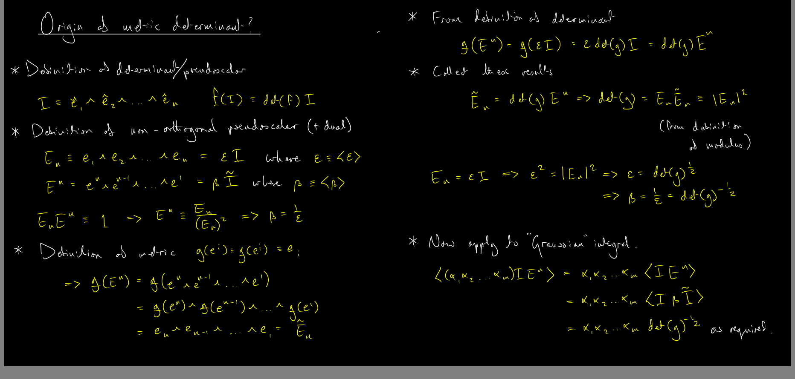
<li>How to construct fermions in two Euclidean dimensions? This is an initial target for the lattice implementation of matter fields on dynamical triangulations. There are some indications that once could simply recycle the even sub-algebra formulation of Doran and Lasenby. If one does this, how can the Grassmann formulation be accommodated? For some remarks, see below.</li>
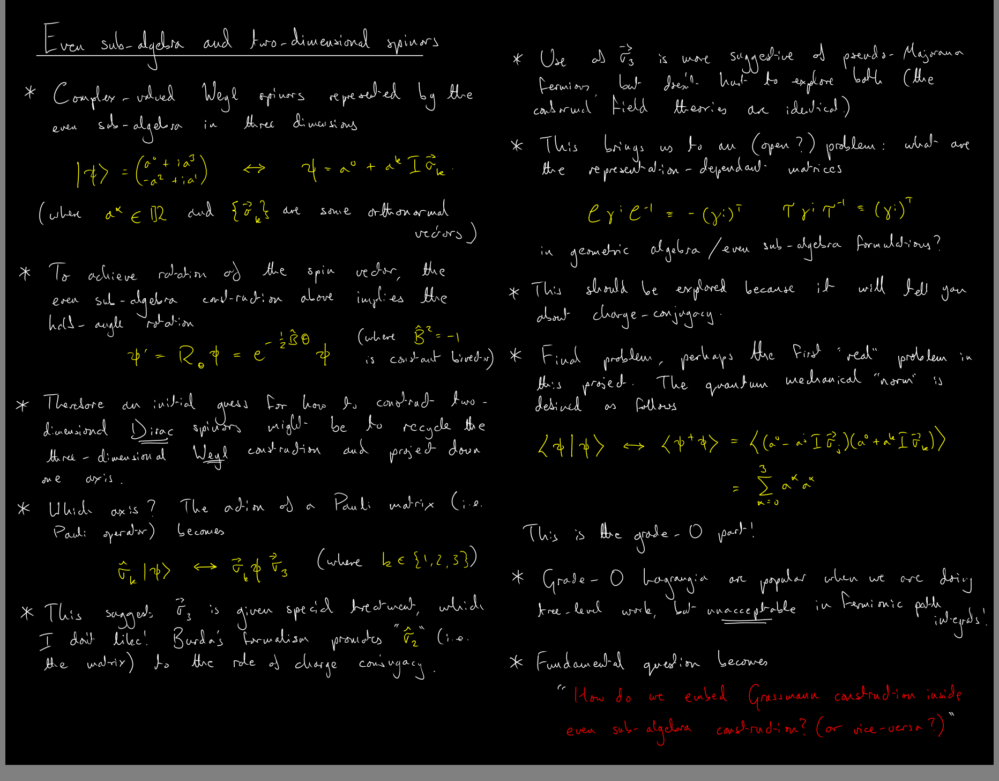
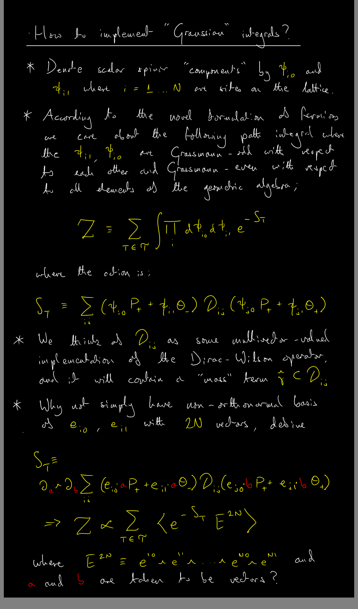
<li>The problem of combining Grassmann-odd variables with the spin structure within one geometric algebra does not actually seem to be so hard. The scalar components can be thought of as inner products of the non-orthonormal Grassmann basis (two basis vectors for each lattice site or node of the dual lattice), with arbitrary vectors \(a\) and \(b\). Care must be taken in constructing the `spin structure part' of the Lagrangian, so that the order of the vectors is reflected in the order of the \((\partial_a\wedge\partial_b)\) prefactor. It should then be possible to extend this setup to non-Gaussian theories via \((\partial_a\wedge\partial_b\wedge\partial_c\wedge ...)\) etc. It may still be possible to recover the Grassmann-odd expressions naturally from the order of operations, but I don't think it can be done if the components are scalars as in the minimal left ideal formulation: since scalars commute with all other grades, their order will be eventually lost whenever bilinear invariants are expanded. Note that the setup to the right is actually simpler than that which I proposed in the meeting on Thursday 2nd February 2023, in that the wedge product does not appear between the spinors.</li>
<li>An especially useful "cheat-sheet" of geometric algebra identities can be found in the file below.</li>

 

<li>Using Eq. (18) from this document, and the definition of the multivector derivative, we can obtain some further very useful identities.</li>
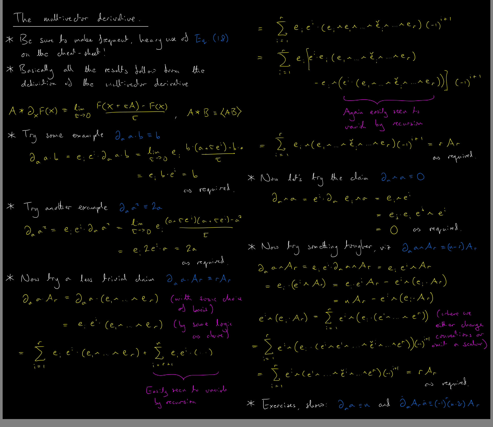
</ol>
<h3>
Perturbative quantum gravity
</h3>
<ol>
<li>Luca Buoninfante's thesis <i>Ghost and singularity free theories of gravity</i>, also 'Xived at <a href="https://arxiv.org/abs/1610.08744">arXiv:1610.08744</a>, provides a great pedagogical introduction to the connection between a QFT propagator and the resulting "particle spectrum", and explains why this line of thinking requires a systematic approach (spin-projection operators, SPOs) when the classical field theory contains some d.o.f-rich bosonic fields (commuting tensors with lots of components, as we have in electromagnetism's vector gauge potential \(A^\mu\)). It is slightly unnecessary to use these techniques for QED, but it becomes helpful to use them for gravity whose gauge fields \(h_{\mu\nu}\equiv g_{\mu\nu}-\eta_{\mu\nu}\) produces waves with only <i>two</i> polarisations (not <i>ten</i>). The modified gravity theories in this project have many more than ten d.o.f in their tensor components, so the concept of a "particle spectrum" becomes mandatory.</li>
<li>A fairly old (and well-known) treatment of the particle spectrum of torsion gravity <a href="https://arxiv.org/abs/1411.5613">arXiv:1411.5613</a>. This is mostly for context, since it covers a broader category of theories to those addressed in the project (so-called <i>parity-violating</i>). However, the underlying method used by Karananas is the same as the one which we will be using.</li>
<li>Initial application by our group of the SPO method to torsionful theories in <a href="https://arxiv.org/abs/1812.02675">arXiv:1812.02675</a>. In principle, the whole methodology we are using for these projects is contained within this paper, but be careful because it is <i>extremely terse</i>!</li>
<li>A follow-up paper to arXiv:1812.02675 is given in <a href="https://arxiv.org/abs/1910.14197">arXiv:1910.14197</a>. This paper provides some extra insights into the information which the propagator can provide about renormalisability. For the moment, it should be only of contextual interest: in gravity we take unitarity to have primacy, and renormalisability (which we do not see at first glance in GR) is a bonus.</li>
<li>A final paper in the Yun-Cherng Lin series is found at <a href="https://arxiv.org/abs/2005.02228">arXiv:2005.02228</a>. This paper extends beyond torsion gravity into a related set of models comprising <i>Weyl gauge theory</i> (WGT). There is no accommodation in the PSALTer code for WGT, so extensions to this area within the project will be quite speculative.</li>
<li>For more information about WGT and its extensions, see <a href="https://arxiv.org/abs/1510.06699">arXiv:1510.06699</a>. This paper is really more for background reading, but it serves as a cross-check on our conventions for the gauge-theoretic formulation of gravity.</li>
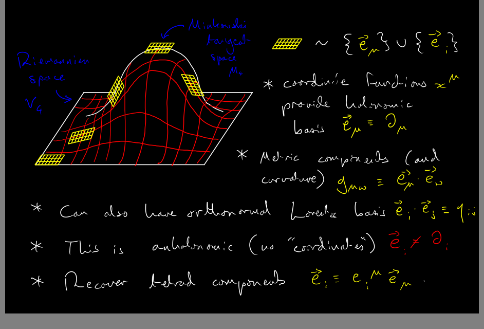
<li>Speaking of our conventions, we mostly adhere to the setup in <a href="http://alpha.sinp.msu.ru/~panov/LibBooks/GRAV/Blagojevic_M.-Gravitation_and_gauge_symmetries(2002).pdf">Blagojevic's excellent book</a>. For the most part, you won't need anything from beyond the <b>first three chapters</b>. The critical level of understanding, so as to be able to connect with the QFT literature, is as follows. You should be able to expand some Lagrangian \(\mathcal{L}=b\mathcal{L}(A^{ij}_{\ \ \ \mu},h^i_{\ \mu})\), constructed from the Riemann-Cartan and torsion tensors and various other ingredients (such as derivatives), to quadratic order around the vacuum. You should also be satisfied that the whole is invariant under translational and Lorentz-rotational gauge transformations.</li>
<li> A very useful resource which will combine much of the above literature is <a href="https://www.repository.cam.ac.uk/handle/1810/314917?show=full">Yun-Cherng's Ph.D. thesis</a>. The PSALTer code uses very different methods to those described in this implementation (which is a complicated search over root systems), but the background physics will be very useful.</li>
<li> The PSALTer code itself, when a student-friendly version is finished later this term, will be available for download here. For the moment, you can <a href="/assets/mastersprojects/propagator-evaluated.nb" download><button type="button">download a Mathematica notebook</button></a> in which I've performed the particle spectrum analysis.</li>
<li> A Lent-term update to the last item above: a student-friendly version of PSALTer is now ready and functional. However the research programme has since developed into a broader collaboration and <b>in order to protect the IP I'll be moving the source code over from GitHub to GitLab soon</b>. To use PSALTer in the interim, please ask in person. For the moment, you can refer to the output below of the analysis of Einstein-Cartan gravity and general relativity.</li>

 

<li>Another Lent-term update to the last item above: a demonstration for how to install and use PSALTer from a cold start can be found in the video below. Note that this version of PSALTer has been prepared for you with a HiGGS dependency: since the start of your projects I've been working on a way to seaparate HiGGS out entirely so that you should have a highly mutable version to work with (you will be able to introduce user-defined theories, and not just be restricted to the PGT). This new version should be available within the next week or so.</li>
<iframe width="100%" height="415" src="https://www.youtube.com/embed/uDXnCwpUynA" title="YouTube video player" frameborder="0" allow="accelerometer; autoplay; clipboard-write; encrypted-media; gyroscope; picture-in-picture; web-share" allowfullscreen></iframe>
<li>In this next video, we look at the updated version of the PSALTer package, in which the dependency on  HiGGS has been entirely stripped out, and functionality included for user-defined classes of theories. For some of you, the final task in your Part III project will be to wrap up your results into one of these theory classes and obtain the relevant particle spectra. To help you out on this quest, I've prepared four essentially <i>unrelated</i> theory classes in the basic source code. These are for the scalar, vector, tensor and full Poincaré gauge theories. As we'll see in this video, these classes allow one to do a tremendous ammount of physics already at the touch of a button.</li>
<iframe width="100%" height="415" src="https://www.youtube.com/embed/A6qi0HEF1J0" title="YouTube video player" frameborder="0" allow="accelerometer; autoplay; clipboard-write; encrypted-media; gyroscope; picture-in-picture; web-share" allowfullscreen></iframe>
<li>Having delved into the physical interpretation of the PSALTer output, in this next video we will provide some step-by-step instructions for developing your own theoy class.</li>
<iframe width="100%" height="415" src="https://www.youtube.com/embed/teu_FGmlgco" title="YouTube video player" frameborder="0" allow="accelerometer; autoplay; clipboard-write; encrypted-media; gyroscope; picture-in-picture; web-share" allowfullscreen></iframe>
<li>Now that you've developed your own theory class, it is time to test it. In this video we will cover <tt>$DiagnosticMode</tt> and the build log, and provide explicit instructions for checking whether your spin-parity decomposition has been done correctly.</li>
<iframe width="100%" height="415" src="https://www.youtube.com/embed/_NVC5YnksfI" title="YouTube video player" frameborder="0" allow="accelerometer; autoplay; clipboard-write; encrypted-media; gyroscope; picture-in-picture; web-share" allowfullscreen></iframe>
<li>Not that it has to do with particle spectra, but someone was interested in accelerated expansion. For those of us that think it has something to do with a cosmological constant, and who are wondering why the value of such a constant is so small, check out the review by Jerome Martin at <a href="https://arxiv.org/abs/1205.3365">arXiv:1205.3365</a>.</li>
<li>One of the more recent particle spectrum analyses in the space of metric affine gauge theory (the superset of non-metric, Weyl and Poincaré gauge theories of gravity in which the conncetion is entriely general), this gives a very thorough breakdown of the spin-parity decomposition for the general three-index tensor in four dimensions <a href="https://arxiv.org/abs/1912.01023">arXiv:1912.01023</a>.</li>
<li>The initial stages of the particle spectrum analysis assume a momentum-space representation for the Lagrangian, which should be checked when developing `short cuts' for the removal of surface terms. This also connects with the claim that the Lagrangian operator in \(\mathcal{L}=\frac{1}{2}\hat{\zeta}^\text{T}(-k)\hat{\mathcal{O}}(k)\hat{\zeta}(k)\) must be Hermitian.</li>
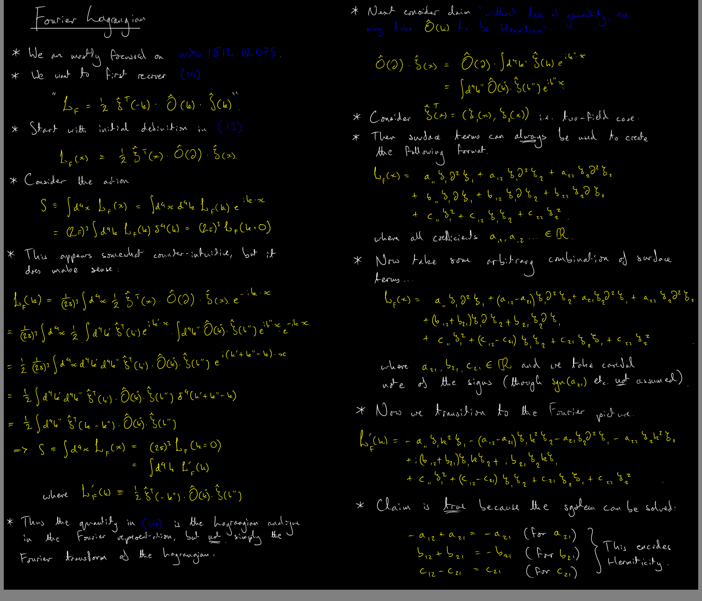
<li>It is important to check that any nontrivial background around which you are perturbing your Lagrangian is satisfied by the perturbed field equations at lowest order. This is a basic self-consistency requirement. For more on this, see some notes below.</li>
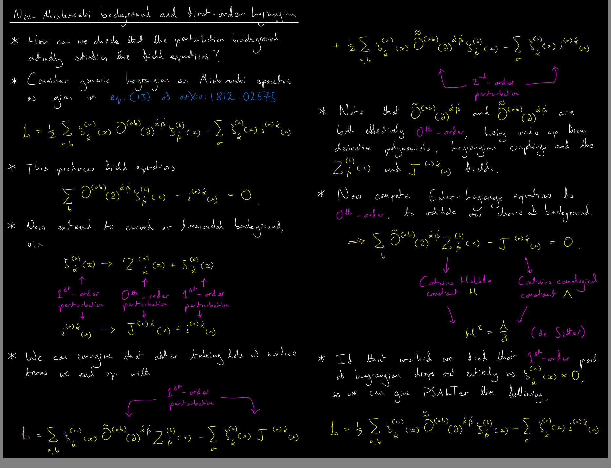
</ol>
<h3>
Non-perturbative quantum gravity
</h3>
<ol>
<li><a href="https://hef.ru.nl/~tbudd/">Tim Budd's</a> <i>excellent</i> <a href="https://hef.ru.nl/~tbudd/mct/intro.html">online course on Monte Carlo techniques</a> should serve as an introduction to how lattice (Q)FTs are implemented on computers. Not all of the applications are to <i>quantum</i> systems, so be careful! However, there is coverage of <i>criticality</i> which is vital in lattice QFT, and even Euclidean dynamical triangulations (which are intended to be quantum), with some quick-start python implementations of the latter.</li>
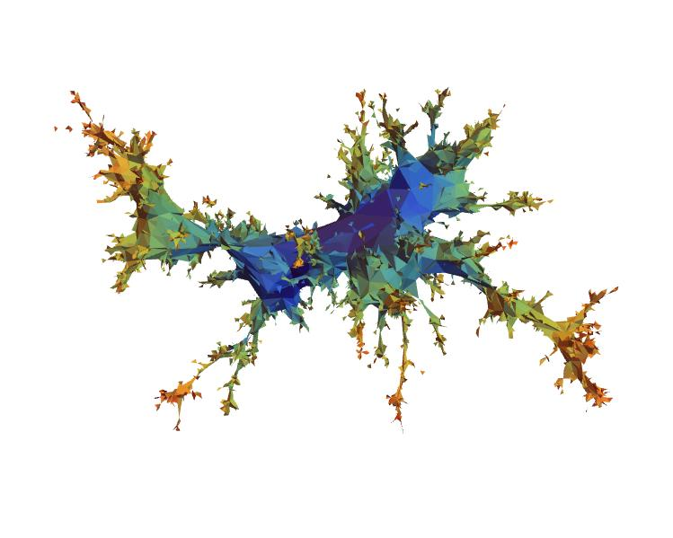
<li>The <a href="https://hef.ru.nl/~tbudd/randgeom/">Dynamical Triangulations course</a>, also by Tim Budd, for <a href="https://perimeterinstitute.ca/">PITP</a>, gives a far more in-depth introduction to random geometries. For those working with triangulation models, I can strongly recommend watching both of the lectures. There are also some C++ and Mathematica resources from this course: be careful however, since the C++ implementation has some "black box" matter coupled to it, while the Mathematica contains some depreciated syntax. I've fixed the notebook, and if you <a href="/assets/mastersprojects/example-analysis.nb" download><button type="button">download it from here</button></a> then you should be able to make some simple embedding visualisations such as that displayed here. 
</li>
<li>A punchy "white paper" by Burda, Jurkiewicz and Krzywicki, which sets out a plan for putting fermions on random lattices, can be found at <a href="https://arxiv.org/abs/hep-lat/9907013">arXiv:9907013</a>.</li>
<li>A paper by the same authors, with much more detail, can be found at <a href="https://arxiv.org/abs/hep-lat/9905015">arXiv:9905015</a>.</li>
<li>A more in-depth discussion of how to implement fermions and Ising systems coupled to two dimensional gravity can be found in <a href="https://arxiv.org/abs/hep-lat/0110063">arXiv:0110063</a>.</li>
<li>Massless Majorana-Wilson fermions coupled to quantum gravity in two <b>Euclidean</b> dimensions are studied in <a href="https://arxiv.org/abs/hep-lat/0107015">arXiv:0107015</a>. I'm happy that this is a standard formulation of EDT.</li>
<li>Massless Majorana-Wilson fermions coupled to quantum gravity in two <b>Lorentzian</b> dimensions are studied in <a href="https://arxiv.org/abs/hep-lat/0306033">arXiv:0306033</a>. I've not confirmed that this is standard CDT.</li>
<li>A summary of the above two papers can also be found at <a href="https://inspirehep.net/literature/634846">this Acta. Phys. Polon. B article</a>.</li>
<li>Something to note about the above implementations (and introductions to conformal field theories) is the restriction to fermions which are symmetric under charge conjugation (Majorana spinors). Majorana spinors will be a pain to work with when including gauge symmetries, so can we use Dirac spinors? To investigate this just at the level of holomorphic/antiholomorphic field equations, see below.</li>
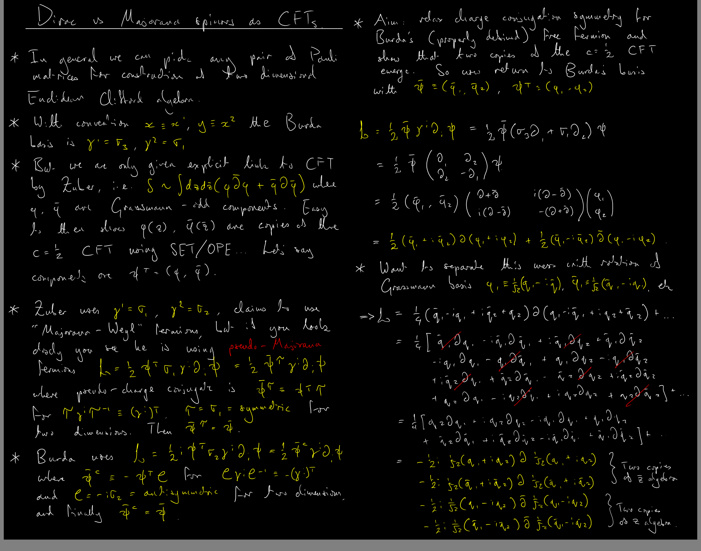
<li>A different (and far more recent) branch of the literature in which CDT and some motivated internal gauge symmetries are considered in two dimensions <a href="https://arxiv.org/abs/2010.15714">arXiv:2010.15714</a>.</li>
<li>The thorough introduction to CFTs from <i>Champs, Cordes et Phénomènes Critiques</i> can be found at <a href="https://arxiv.org/abs/hep-th/9108028">arXiv:9108028</a>.</li>
<li>The conformal algebra in two dimensions has an infinite number of generators. This is quite strange, and indeed when we are doing physics we tend to throw away all the generators which produce singularities at either the north or south pole of the Riemann sphere. In higher dimensions \(d>2\) we obtain a finite algebra simply by looking at infinitessimal coordinate transformations, and the critical observation is that third derivatives of the transformation vector vanish. To recover that result, see below.</li>
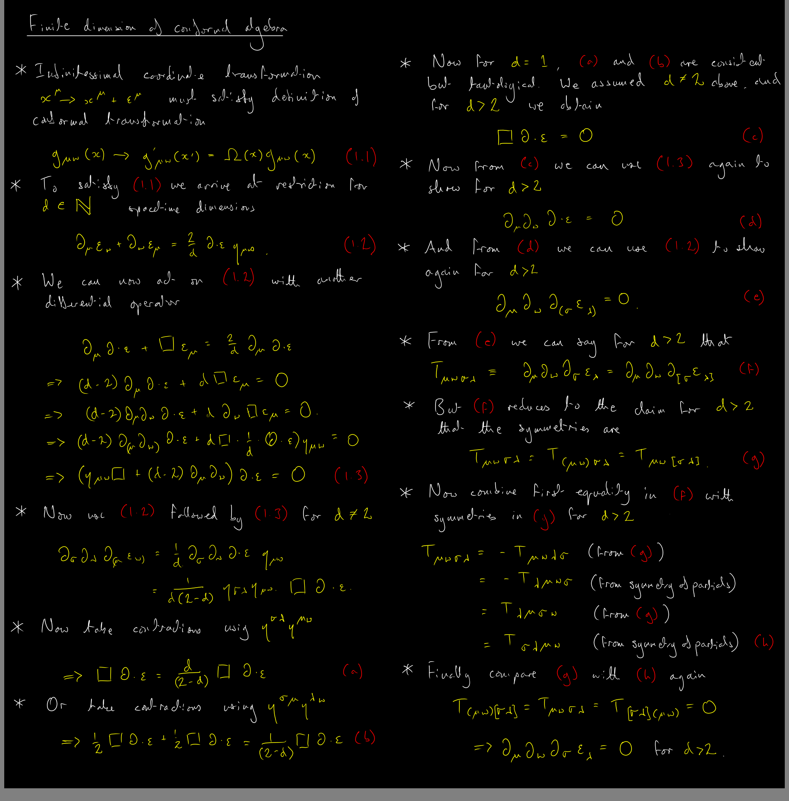
<li>Tong's lectures on statistical field theory can be found <a href="https://www.damtp.cam.ac.uk/user/tong/sft.html">here</a>.</li>
<li>Why restrict to \(N\)-spheres? CDT is implemented on a \(2+1\) torus in <a href="https://arxiv.org/abs/1305.4702">arXiv:1305.4702</a>.</li>
</ol>
<h3>
Cosmological perturbation theory
</h3>
<ol>
<li>Gauge-theoretic formulation of the torsion condensate <a href="https://arxiv.org/abs/2003.02690">arXiv:2003.02690</a>. This is mostly for context, but with fair winds and following seas we might be able to begin to explore perturbation theory directly in the gauge field framework.</li>
<li>Scalar-tensor formulation of torsionful gauge theories, which works at the background level (but how well does it work at the level of perturbations?) <a href="https://arxiv.org/abs/2006.03581">arXiv:2006.03581</a>.</li>
<li>Pedagogical introduction to cosmological perturbation theory found in <a href="https://www.damtp.cam.ac.uk/user/examples/3R2La.pdf">James Fergusson's Part III Cosmology notes</a>.</li>
<li>A slightly more in-depth exploration of perturbation theory, with discussion of extra d.o.f, can be found in <a href="https://www.mv.helsinki.fi/home/hkurkisu/CosPer2.pdf">the "Helsinki" notes</a>.</li>
<li>A fairly up-to-date review of scalar-tensor theories, for contextual interest, can be found at <a href="https://arxiv.org/abs/1901.08690">arXiv:1901.08690</a>. Note that this review covers most of the usual cases of scalar fields which may/may not augment Einstein's theory: the scalar-tensor models in these projects have a unique motivation which is not covered here! That said, Israel Quiros (who is a very <a href="https://inspirehep.net/authors/992509">interesting researcher</a>) has also worked with torsionful models in the past.</li>
<li>A more principled method for extracting extra scalar d.o.f from torsionful theories, with a cosmological/inflationary application, is presented in <a href="https://arxiv.org/abs/1904.03545">arXiv:1904.03545</a>. The main difference here is the guarantee that no extra non-scalar torsion d.o.f are present, which could show up in the perturbation theory.</li>
<li>An attempt to study cosmological perturbation theory using the tetrad and spin connection can be found at <a href="https://arxiv.org/abs/1601.03943">arXiv:1601.03943</a>. In this work, the focus is on the scalar and pseudoscalar parts of the torsion tensor which Tsamparlis first demonstrated to be consistent features of the background cosmology, roughly defined as \(h\sim T{^\mu_{\ \ 0\mu}}\) and \(f\sim \epsilon^0_{\ \ \mu\nu\sigma}T{^{\mu\nu\sigma}}\). Accordingly, the analysis performed in this paper is really quite restrictive (and I'm not even sure if it is physically meaningful), but the Lu and Chee approach is at least worth a read.</li>
<li>It appears that the most concerted (and most recent) work on the cosmological perturbation theory of torsionful gravity has been through the lens of the teleparallel theory. In teleparallel theory, the gravitational Lagrangian density is \(\mathcal{L}=\frac{1}{2}M_{\text{Pl}}^2\mathbb{T}\) where \(\mathbb{T}=\frac{1}{4}T_{ijk}T^{ijk}+\frac{1}{2}T_{ijk}T^{jik}-T^{i}_{\ \ ji}T_{k}^{\ \ jk}\) is a specific combination of quadratic torsion invariants. For teleparallel gravity (and the natural extension to \(f(\mathbb{T})\) gravity) to function like GR, there are some nuanced conditions that have to be applied to the spin connection. It is within the context of these conditions that the cosmological perturbation theory has been explored in papers such as <a href="https://arxiv.org/abs/1911.06064">arXiv:1911.06064</a>, <a href="https://arxiv.org/abs/2001.10015">arXiv:2001.10015</a> and <a href="https://arxiv.org/abs/2110.12332">arXiv:2110.12332</a>. These were skimmed from a half-hour on the arXiv, so I would <b>strongly recommend</b> you make a very thorough literature review of possible approaches to the SVT decomposition in the gauge-theoretic formulation: other authors may have devised some really neat tricks that could save you time!</li>
<li>When your code starts to become successful, you will want to implement background values of the scalar fields \(\phi\) and \(\psi\) which are commensurate with known exact solutions to the cosmological field equations of a given theory. Depending on your project abstract, you might be looking into different theories, but the candidate of most interest to our group is the <i>constant torsion emergent gravity</i> (CTEG), in which the pseudoscalar torsion \(\psi\) adopts a constant background value: the <i>torsion condensate</i> or <i>correspondence solution</i>. Whilst the value of the condensate is well known, as far as I can recall none of the papers on CTEG actually quote the value of \(\phi\) on the background. It turns out after a computation that \(\phi\propto H\) as the Universe evolves with Hubble number \(H\), but that the constant of proportionality varies depending on which kind of matter is dominating the cosmic fluid. To show this, and for inspiration to those who are working on exact solutions to other modified gravity theories (I'm thinking of MoND here!), there is prepared a short Wolfram script with .pdf output below. You can also <a href="/assets/mastersprojects/masters-projects/astrophysics/project-pitt/TorsionCondensate.tar.gz" download><button type="button">download a .tar.gz of the source</button></a>.
</li>

 

<li>In tandem with the Wolfram script above, some parts of the calculation are easiest done by hand. These are shown below, and at the end in the red boxes you can see a summary of the background solutions for the CTEG.</li>
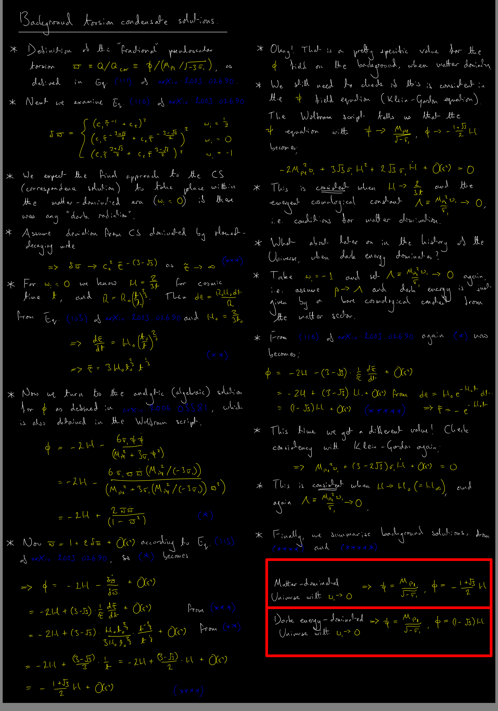
<li>For those students who are working with the full mechanics of the Poincaré gauge theory on the background of an expanding spacetime, the Ricci rotation coefficients \(\Delta^{ij}_{\ \ \ \mu}\) will be needed. <b>They are not necessary if you are working with the scalar tensor analogue theory.</b> If you are using them, it is important to correctly interpret the valences and tangent spaces associated with the different slots, because both raising/lowering and exchanging of Greek/Roman indices become nontrivial operations at zeroth order on the expanding background. The following notes may be of use not only for the cosmological perturbation theory, but also for the particle spectrum.</li>
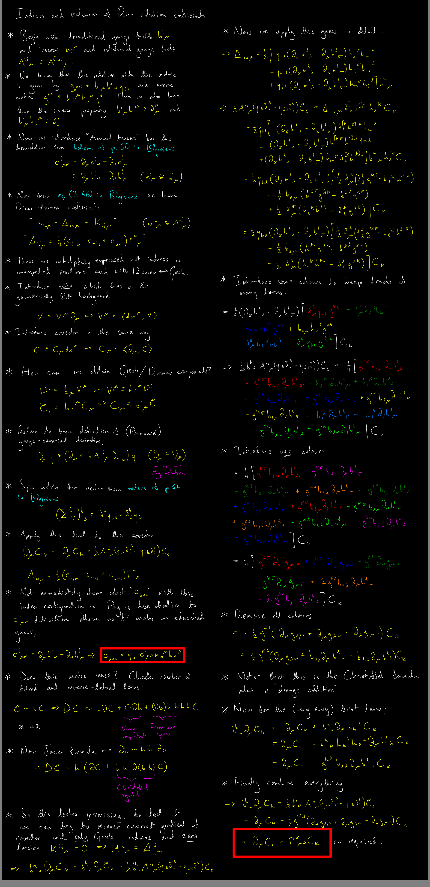
<li>The initial step in the development of a cosmological perturbation theory is the identification of the gauge-invariant modes. First the gauge fields are set out, then they are perturbed around the FLRW background. Next, infinitesimal gauge transformations are taken and the perturbed, gauge-transformed gauge fields are decomposed according to the SVT formalism. Among the decomposed fields, it is possible to notice how all the SVT modes themselves transform. Equipped with this knowledge, combinations of the SVT modes are concocted which are gauge invariant, their inhomogeneous transformation terms cancelling internally. To see a great example of this working in practice, check out <a href="https://arxiv.org/abs/2011.02491">arXiv:2011.02491</a>, as written by a true master in the field. <b>The process is well described for the teleparallel model (see above) over sections 5.2 and 5.3 within that paper.</b> To get some inspiration on how to do this for the case of vector-only torsion, see the notes below.</li>
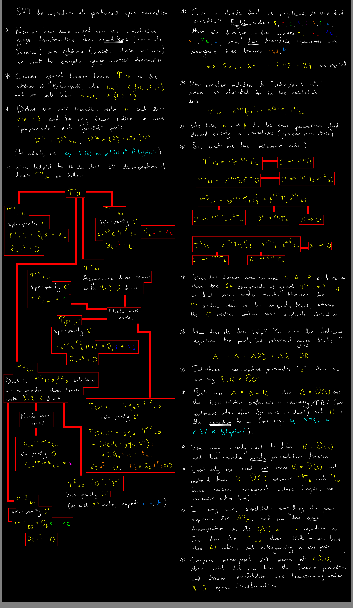
<li>The next question comes as "<b>Why are we using vector-only torsion?</b>" This is quite a delicate question, and the short answer is "<b>Because full torsion is probably too complicated for a Part III project!</b>" Even within the context of vectors, we have further restricted to the scalar modes from the SVT decomposition, as the simplest possible baby-case of the theory. To conclude that this is a gross over-simplification of the physics is probably valid for the particular model at hand: this project was advertised as being for the analysis of the CTEG theory, in which no modes are assumed to be deactivated for any reason. However, there are some quite profound motivations for restricting to vector and axial vector parts of the torsion in the context of other theories. Consider the draft below (this is not yet published, so you can recycle parts of the introduction into your reports without needing to cite at this stage). When the tensor part of the torsion is present, it causes the vector and axial vector parts to propagate as a combined, strongly-coupled Kalb--Ramond field (a two-form field better known from string theory). This strong coupling is unacceptable, and it can be alleviated (in this specific scenario) by killing off the tensor part of the torsion with a multiplier field.</li>

 

<li>Some sketch of the process for recovering the Bardeen potentials from the (enhanced) scalar perturbation modes of the tetrad field can be found below.</li>
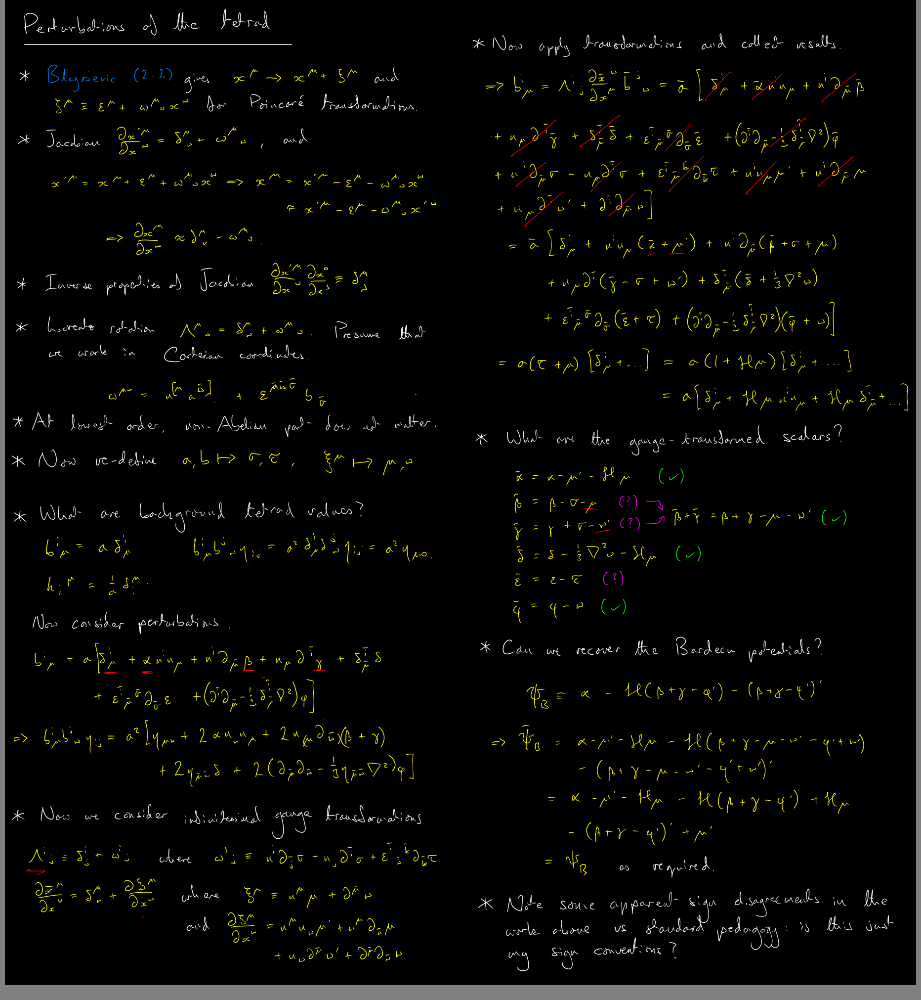
<li>Here are the field equations. The initial equations are those of a curious torsion theory in which the Einstein-Hilbert Lagrangian is augmented with the square of the antisymmetric part of the Riemann-Cartan-Ricci tensor. In this case, we might reasonably expect that there is propagating torsion, but in fact we do not find any new degrees of freedom. It would be good to confirm this state of affairs using the cosmological perturbation theory! You can <a href="/assets/mastersprojects/masters-projects/physics/project-loncar/sqr_MarcosFieldEquations.tar.gz" download><button type="button">download a tarball of the sources</button></a>.</li>

 

<li>There is some question surrounding the nature of the scalar mode in the spin-2 parity-odd sector of the connection field. This mode has (to the best of my knowledge) never been treated with the SVT decomposition method. However, a quarter-hour of tinkering suggests that it is not too hard to obtain. Please double-check my results. You can <a href="/assets/mastersprojects/masters-projects/physics/project-loncar/sqr_ParityOddSpinTwoScalar.tar.gz" download><button type="button">download a tarball of the sources</button></a>, or see an embedded pdf below.</li>

 

</ol>
<h1>
Logistics
</h1>

Below is some logistical information about the structure of research projects, including relevant deadlines. Much of this is transplanted from the various departmental websites (which you should check regularly for updates), but in places where I have my own deadlines/ammendments I will indicate in <b><i><u>bold, underlined and italic</u></i></b> script.

<h2>
Quasi-regular Friday meetings
</h2>

Research group meetings for (confirmed) new members, and members who joined as summer students in recent months, will be held in <b>slots from 09:00-14:30 on Fridays (with later slots for those who really can't make the morning)</b>. These will be in-person by default, but a Zoom room will be open during that period. Book these below.

<b><i><u>
Note that whilst both astrophysicists and physicists are expected to focus more on projects during Lent term, the degree to which I can expand my calendar to match will be very limited. Therefore, I'd strongly advise that we make the most of meetings during Michaelmas.
</u></i></b>

<!-- Google Calendar Appointment Scheduling begin -->
<iframe src="https://calendar.google.com/calendar/appointments/schedules/AcZssZ2rlftiTVc1FW6DX2GVlOX6juU4pkSp6oYZNp8W3XTBYqd069Wd8thI1uqId_Wufc5qAHf2JOrf?gv=true" style="border: 0" width="100%" height="600" frameborder="0"></iframe>
<!-- end Google Calendar Appointment Scheduling -->
<h2>
M.Sci. and M.Ast. students for Part III Astrophysics (applications CLOSED)
</h2>
<h3>
Michaelmas Term
</h3>

An electronic PDF copy interim progress report, length no more than 1,000 words, bearing the
signature(s) of the main supervisor(s) and second supervisor, must be uploaded to the Part III/MASt
Astrophysics Moodle site no later than <b>12:00 Friday 2nd December 2022</b> (the last day of Michaelmas Full
Term). The report should be produced with LaTeX, or an equivalent text-processing package and may
contain material that can be incorporated in the final project report. The interim report must indicate
the progress made so far and show preliminary results. It should also give a clear indication of the project
aims and a detailed plan of how these aims will be achieved. This is particularly important where the
results of the project depend on data that has yet to be analysed. There is no need for the interim report
to reiterate the material given in the Project Handbook. The interim reports do not constitute part of the
formal assessment but are regarded as an essential part of the monitoring procedure. The Course
Coordinator will assess these reports and provide feedback to students and supervisors.

<iframe src="https://free.timeanddate.com/countdown/i8k1c297/n1234/cf11/cm0/cu4/ct0/cs0/ca0/cr0/ss0/cac000/cpc000/pc0f9/tcfff/fs100/szw320/szh135/tatTime%20left%20to%20deadline/tac000/tptTime%20since%20deadline/tpc000/matInterim%20Report/mac000/mptInterim%20Report/mpc000/iso2022-12-02T11:59:59" allowtransparency="true" frameborder="0" width="252" height="54"></iframe>
<h3>
Lent Term
</h3>

Practice oral presentations, consisting of a 20-minute talk followed by up to 10 minutes of questions, to
an audience of Part III Astrophysics students, Project Supervisors and the Project Coordinator will be
given on the <b>last Tuesday, Wednesday, Thursday, and Friday of Lent Term (14th, 15th, 16th and 17th March
2023)</b>. A final timetable for the presentations will be provided by e-mail during the previous week. This
practice presentation is not formally assessed but offers the opportunity to become familiar with the
format of the presentation, to be assessed by the Part III Examiners in the Easter Term. Students are
encouraged to attend the practice talks of their peers which will help strengthen their presentation
techniques. 

<h3>
Easter Term
</h3>

A draft of the final project report, generated with LaTeX or an equivalent text-processing package, should
be handed to the Project Supervisor no later than <b>Monday 24th April 2023</b>. The last Supervision, to
discuss the draft report, should take place no later than <b>Monday 1st May 2023</b>.

<b><i><u>
I will not be available on Monday 1st, so our final supervisions will be our usual meeting slots on Friday 28th April.
</u></i></b>

<iframe src="https://free.timeanddate.com/countdown/i8k1c297/n1234/cf11/cm0/cu4/ct0/cs0/ca0/cr0/ss0/cac000/cpc000/pc0f9/tcfff/fs100/szw320/szh135/tatTime%20left%20to%20deadline/tac000/tptTime%20since%20deadline/tpc000/mat%20draft%20of%20the%20final%20project%20report/mac000/mpt%20draft%20of%20the%20final%20project%20report/mpc000/iso2023-04-24T23:59:59" allowtransparency="true" frameborder="0" width="260" height="54"></iframe>

<iframe src="https://free.timeanddate.com/countdown/i8k1c297/n1234/cf11/cm0/cu4/ct0/cs0/ca0/cr0/ss0/cac000/cpc000/pcff0/tcfff/fs100/szw320/szh135/tatTime%20left%20to%20event/tac000/tptTime%20since%20event/tpc000/matlast%20supervision/mac000/mptlast%20supervision/mpc000/iso2023-04-28T09:00:00" allowtransparency="true" frameborder="0" width="261" height="54"></iframe>

An electronic PDF copy of the final project report must be uploaded to the Part III/MASt Astrophysics
Moodle site no later than <b>12:00 BST Monday 8th May 2023</b>. Late submissions are very strongly
discouraged because you will be left with insufficient time to properly revise for the written
examinations. In circumstances in which it is unavoidable you must seek permission in advance and then
any late submissions must be submitted via your college Tutor with an accompanying letter of
explanation from the Tutor. Your University Examination Number must NOT appear anywhere in the
report or on the cover sheet.

<iframe src="https://free.timeanddate.com/countdown/i8k1c297/n1234/cf11/cm0/cu4/ct0/cs0/ca0/cr0/ss0/cac000/cpc000/pc0f9/tcfff/fs100/szw320/szh135/tatTime%20left%20to%20deadline/tac000/tptTime%20since%20deadline/tpc000/matFinal%20submission/mac000/mptFinal%20submission/mpc000/iso2023-05-08T11:59:59" allowtransparency="true" frameborder="0" width="261" height="54"></iframe>
<h3>
Register interest
</h3>

The projects which were advertised can be found in the <a href="https://www.astro.phy.cam.ac.uk/">IoA project booklet</a>.

The IoA has provided the results of their student allocation algorithm. All projects are now allocated.

<h2>
M.Sci. and MASt students for Part III Physics (applications CLOSED)
</h2>

To see a list of abstracts on offer, go to the <a href="https://www-teach.phy.cam.ac.uk/students/courses/projects/100">Teaching Information System</a>.

In response to popular demand, one new project was added, to be co-supervised by <a href="https://www.fzu.cz/en/people/amel-durakovic-phd">Dr. Amel Durakovic</a>.

<h3>
Progress reports
</h3>

Students will be asked to complete two progress reports. At the end of the Michaelmas Term, you must submit an Initial Report (one copy; between 4 and 6 A4 pages in length).  This Initial Report should describe the project in your own words, putting the physics into context (including references to the relevant literature) and describing the goals of the project; it must also include a project plan. This report should be electronically signed by both you and your supervisor to indicate his or her agreement with the plan and should be uploaded onto the TIS by <b>Friday 2 December 2022</b> by the student. A copy of the Initial Report will be retained by the Undergraduate Office and forwarded to the assessor in Easter Term – failure to submit an Initial Report will result in the loss of 5% of the available project marks. 

<iframe src="https://free.timeanddate.com/countdown/i8k1c297/n1234/cf11/cm0/cu4/ct0/cs0/ca0/cr0/ss0/cac000/cpc000/pc0f9/tcfff/fs100/szw320/szh135/tatTime%20left%20to%20deadline/tac000/tptTime%20since%20deadline/tpc000/matInitial%20Report/mac000/mptInitial%20Report/mpc000/iso2022-12-01T23:59:59" allowtransparency="true" frameborder="0" width="252" height="54"></iframe>

The second report is a simple “tick box” form, which can be downloaded from the TIS during week three of the Lent term. This will invite you to report any problems with your project, and to confirm that a presentation has been scheduled.  The form should be uploaded to the TIS by <b>Wednesday 8 February 2023</b>. The second report will not form part of any assessment but will allow any problems to be identified by Professor Hirst well before the time the project has to be handed in.

It is very important that students bring any unforeseen delays or other problems with their projects to Professor Hirst’s attention at the earliest possible opportunity. The earlier such problems are addressed, the more chance there is of taking suitable remedial action.

<iframe src="https://free.timeanddate.com/countdown/i8k1c297/n1234/cf11/cm0/cu4/ct0/cs0/ca0/cr0/ss0/cac000/cpc000/pc0f9/tcfff/fs100/szw320/szh135/tatTime%20left%20to%20deadline/tac000/tptTime%20since%20deadline/tpc000/mat%E2%80%9Ctick%20box%E2%80%9D%20form/mac000/mpt%E2%80%9Ctick%20box%E2%80%9D%20form/mpc000/iso2023-02-07T23:59:59" allowtransparency="true" frameborder="0" width="261" height="54"></iframe>
<h3>
The project write-up
</h3>

The project should usually be presented in the style of a paper published in a scientific journal. The main text (excluding appendices and abstract) should be concise (20–30 pages, 5000 words maximum (excluding references)). The text should describe and explain the main features of the project, the methods used, results, discussion and conclusions, and should be properly referenced. Detailed measurement records, calculations, programs, etc. should be included as appendices.  In addition, there must be an abstract of at most 500 words.

This final write-up is an important part of the project and must be the student's own work. A lecture on Project report writing will be given on <b>Tuesday 24 January 2023 at 4:00pm in the Small Lecture Theatre</b>.  Once the majority of the research work has been completed, the student and supervisor should discuss the general structure and content of the report before writing is started.  Thereafter, the student must write the final report without advice on the report from the supervisor, although discussion of the scientific results is allowed during this period. A set of handy tips and information is given in the booklet entitled <a href="https://www.phy.cam.ac.uk/students/teaching/teachingfiles/keeping-lab-notes.pdf">Keeping Laboratory Notes and Writing Formal Reports</a>.

<iframe src="https://free.timeanddate.com/countdown/i8k1c297/n1234/cf11/cm0/cu4/ct0/cs0/ca0/cr0/ss0/cac000/cpc000/pcff0/tcfff/fs100/szw320/szh135/tatTime%20left%20to%20event/tac000/tptTime%20since%20event/tpc000/matlecture%20on%20Project%20report%20writing/mac000/mptlecture%20on%20Project%20report%20writing/mpc000/iso2023-01-24T15:59:59" allowtransparency="true" frameborder="0" width="252" height="54"></iframe>
<h3>
Submission of the project
</h3>

The deadline for submission of the project is:

<b>4:00 pm on the third Monday of Easter Full Term (15 May 2023)</b>

A request for a delay in the hand-in date of your project report due to illness must go through your Director of Studies and then be agreed by the Applications Committee.  Treat this deadline like you would an exam date.

The project report should be submitted as a pdf file to the TIS before the submission deadline.  A link to your on-line notebook should also be added to the first page of your report before uploading the project.

To preserve anonymity when your project is looked at by the Part III examiners, your name must not appear on the project report itself.  You should ensure that your candidate number appears on the first page of your project, together with the title of the project and your supervisor’s name.

Your project report should contain the following statement on the first page of the project: Except where specific reference is made to the work of others, this work is original and has not been already submitted either wholly or in part to satisfy any degree requirement at this or any other university.

<iframe src="https://free.timeanddate.com/countdown/i8k1c297/n1234/cf11/cm0/cu4/ct0/cs0/ca0/cr0/ss0/cac000/cpc000/pc0f9/tcfff/fs100/szw320/szh135/tatTime%20left%20to%20deadline/tac000/tptTime%20since%20deadline/tpc000/matFinal%20submission/mac000/mptFinal%20submission/mpc000/iso2023-05-15T15:59:59" allowtransparency="true" frameborder="0" width="261" height="54"></iframe>
<h3>
Register interest
</h3>

To apply to a project, please <a href="mailto:wb263@cam.ac.uk">email</a> me a copy of your CV, with some indication of your undergraduate exam record, and book a slot to discuss from the appointments below (you don't need to be "invited" to meet, just turn up!):

<!-- Google Calendar Appointment Scheduling begin -->
<iframe src="https://calendar.google.com/calendar/appointments/schedules/AcZssZ1obNPpHtbCcAf54KFNqb2GrAent8NdPDVkIlsz90WBvds-_D3W0_XtBCCDQDZ7Hj_-aYp-5UjF?gv=true" style="border: 0" width="100%" height="600" frameborder="0"></iframe>
<!-- end Google Calendar Appointment Scheduling -->

Initial allocations were made on Friday 14th and Sunday 16th October. Final allocations were made on Tuesday 18th October. All projects are now allocated.

</body>
