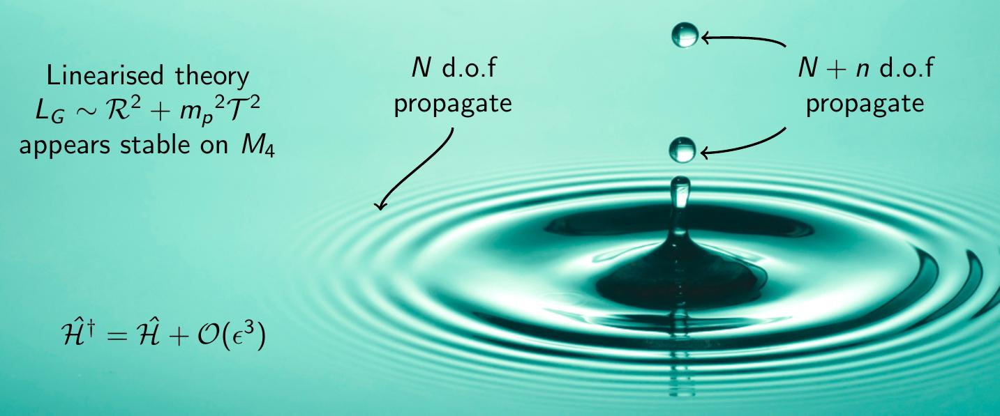
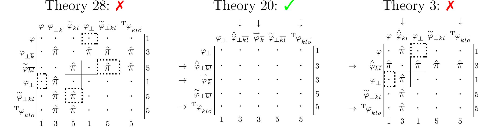
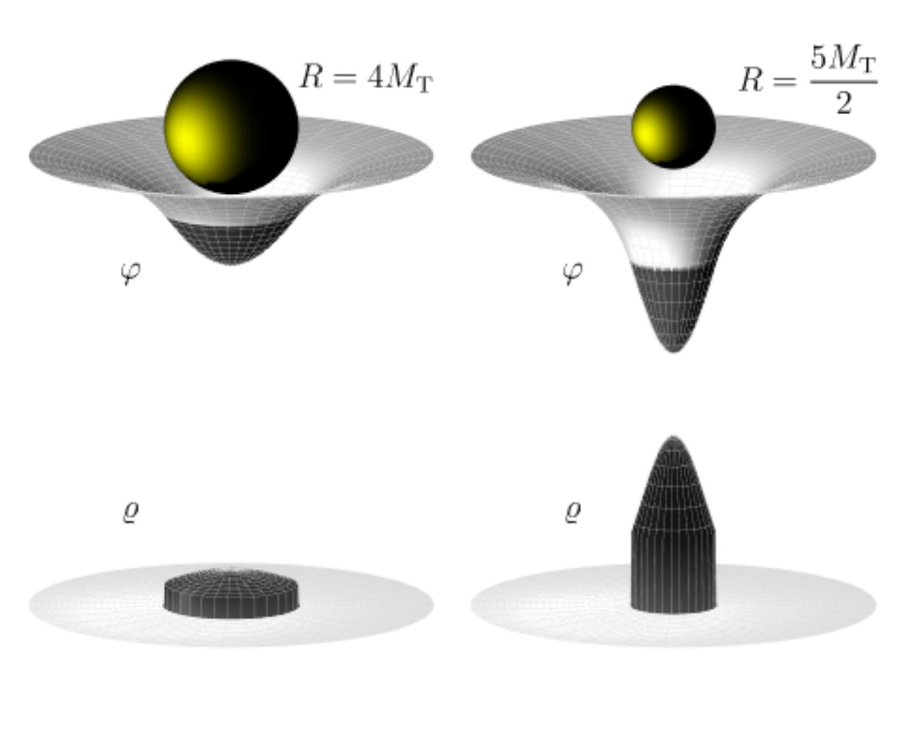
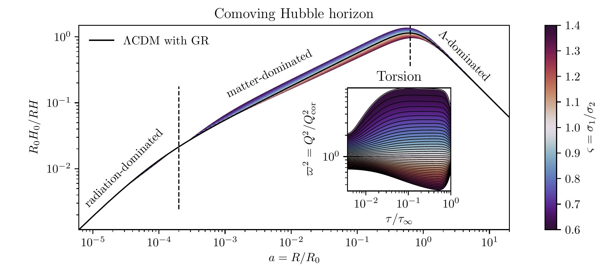
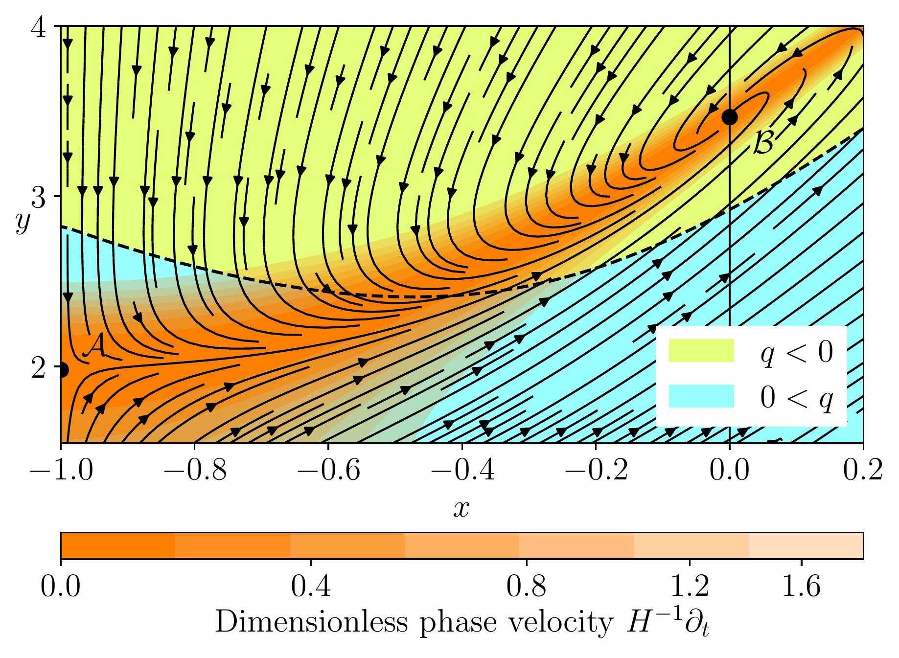

<body class="sph1">
<head>
<!--<meta name="viewport" content="width=device-width, initial-scale=1">-->

</head>
<h2>
Quick breakdown
</h2>

Modified gravity and early-Universe cosmology. Use of the inflationary epoch to probe the high-energy completion of GR. Effective field theories of inflation. Quantum gravity and QFT on curved spacetime. Localisation of gravitational energy.

<h2>
Current research
</h2>

My main research interest is in gravitational theory and quantum gravity. Today, the preferred description of the gravitational force is given by <em>general relativity</em> (GR), first formulated by Albert Einstein over 100 years ago. However, it is reasonable to assume that GR is just an <em>effective</em> theory, valid for the low-energy (IR) regimes probed by laboratory experiments and observed in astrophysical phenomena. Even in these regimes, it is still possible that GR might be incomplete. For example, the IR limit seems not to account for the high speed at which stars orbit the centres of their host galaxies. For various persuasive reasons, it is thought that this is due to the extra gravitational force of obscured <em>dark matter</em> rather than a fault with GR. I'm most interested in high-energy (UV) extensions to GR, concomitant with a predictive quantum theory of gravity.

String theory is one powerful candidate for this quest, but usually has an abstract construction in \(d>4\) spacetime dimensions (for a gentle intermediary, check out Kaluza-Klein theory). I'm currently interested in <em>geometric</em> extensions to the \(d=4\) gravity of Einstein. In GR, the gravitational field is equivalent to the <em>curvature</em> of spacetime. However, there are other geometric qualities such as <em>non-metricity</em> and <em>torsion</em>. These non-Riemannian geometric gauge theories of gravity make for natural extensions to the standard model of particle physics. Moreover, they could still be compactifications of someting higher-dimensional.

Just at the moment, I'm focussed on the problem of strong coupling in these theories. Essentially, conclustions drawn from the linearisation of some theory on a desired background (e.g. flat or de Sitter spacetime), are often useless. The backgrounds can be ruined by strongly-coupled degrees of freedom, which become dynamical in the nonlinear regime. You can understand this through the heuristic figure above. Imagine a droplet impact in reverse: concentric capillary waves on the flat background obey the linear wave equation and the theory has no ghosts or tachyonic shocks. However, where the waves meet at the centre, nonlinear effects such as droplets may develop which are <em>qualitatively</em> different from the linear picture. I'm working on methods to identify the problem at the classical level, using the constrained Hamiltonian analysis.
The figure on the right schematically shows the nonlinear commutators of primary constraints from three candidate theories of gravity. Non-commuting constraints \(\hat{\pi}\) indicate that a gauge symmetry is broken and the theory develops a tachyon on approach to flat Minkowski spacetime: a fatal pathology!

Observational constraints are a separate area of interest. Cosmology is arguably the most powerful testing-ground for gravitational theory. Non-Riemannian theories of gravity are expected to leave some signatures in the quantum fluctuations during inflation. These fluctiations seed structure formation in the late universe, so the theories could be predictive at the level of the cosmic microwave background (CMB) or large scale structure (LSS) bispectra. There may be other clues, for example in the intrinsic alignment of galaxies. The approach I'm using to formulate these ideas is one of <em>effective field theory</em> (EFT). A general expansion for non-Riemannian theory is shown below.

<h2>
Past research
</h2>

To see what I've worked on in the past, check out Publications, and the unpublished Gravity Laser project. I've always been interested in the localisation of gravitational energy. It is possible to construct a unique stress energy tensor for all the fields in the standard model, but not for gravity (or at least not for GR).
This is very strange, since we know that gravitational fields can store and transport energy. In the first year of my Ph.D. I explored this issue a bit further. Probably the oldest diffeomorphism gauge-dependent ways to express gravitational energy is through the very simple pseudotensor of Einstein
\[\kappa\tau_{\sigma\lambda}\equiv\tfrac{1}{2}g^{\beta\gamma}g^{\epsilon\alpha}\big(
\partial_\sigma g_{\epsilon[\beta|}\partial_\lambda g_{|\alpha]\gamma}
+\partial_{(\alpha|} g_{\sigma\epsilon}\partial_{|\lambda)} g_{\beta\gamma}
-\partial_\beta g_{\sigma\epsilon}\partial_\lambda g_{\alpha\gamma}\big).\]
I showed that this pseudotensor can be obtained by systematically absorbing the loss of conserved matter stress energy into the affine connection at each level of a perturbative expansion. This reveals the Einstein pseudotensor as the ultimate extension of the linear energy localisation scheme. I also found a neat result, that the Einstein pseudotensor describes the gravitational energy of any spherical source as if gravity were a simple scalar Klein-Gordon field theory, but only if the diffeomorphism gauge is fixed isotropically. This is shown above for a uniform-density sphere as it shrinks towards the critical Buchdahl limit: the minimum radius beyond which collapse to a black hole is inevitable.

In recent years, I've been working on the non-Riemannian modified gravity theories described above. Specifically, I've focussed on torsion theories. A particular theory rose to prominance, which is capable of reproducing the cosmological background of GR, as shown on the right, along with the Schwarzschild vacuum solution and pp waves. This is quite exciting, because the theory doesn't even contain the Einstein-Hilbert term in its Lagrangian. Another exciting feature of the theory is its ability to generate its own dark energy, through an effective cosmological constant term. 

Even if the bare cosmological constant is <em>negative</em> \(\Lambda<0\), the Universe still accelerates as shown on the left. While the theory was initially proposed as being unitary and power counting renormalisable when linearised on a flat background, it is expected that problems might arise in the nonlinear regime.

