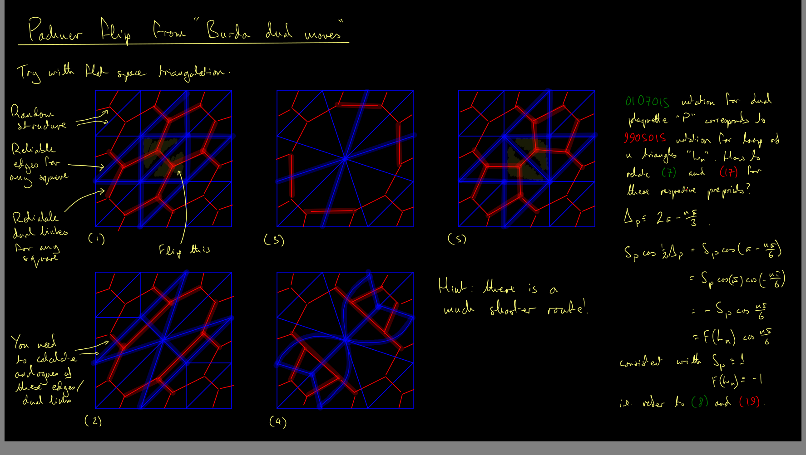
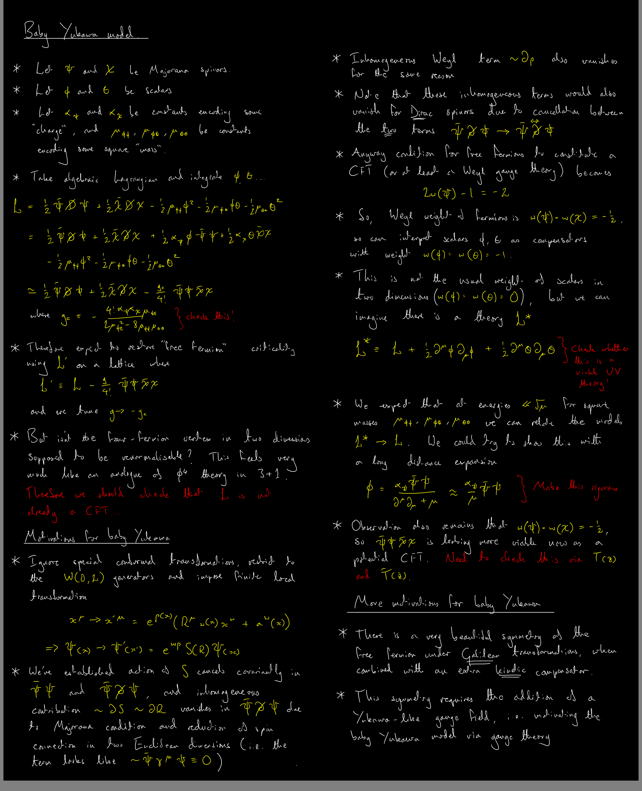
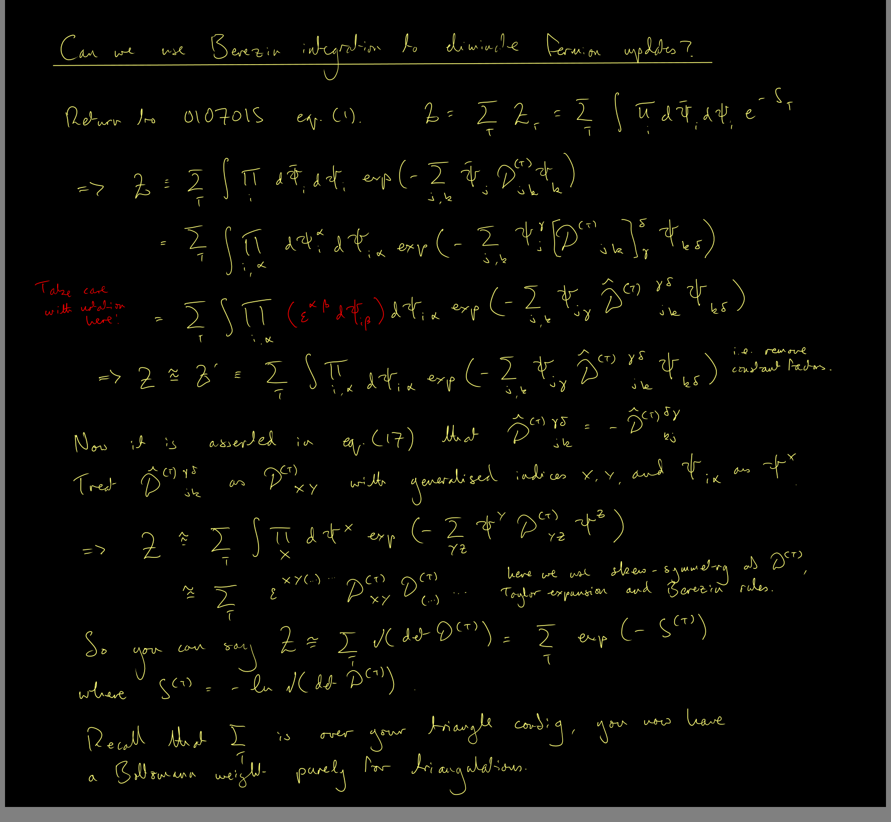

<body class="sph7">
<h1>
The group
</h1>

The embed below should be clickable.

<embed
  src="/assets/CV/StuGantt/StuGantt.pdf#toolbar=0&navpanes=0&scrollbar=0"
  width="100%" height="300" />
<h2>Summer of 2023</h2>
<h3>
Cosmological perturbation theory
</h3>

Marco's attempt to discover the perturbation theory of the scalar modes in PGT seems to have been extremely successful. To improve our confidence in the results, it seems a good idea to repeat the calculations on some well-understood theories in which (extra) scalars are known to be moving. The inspiration for these parameter choices is taken directly from <a href="https://arxiv.org/abs/gr-qc/9902032">arXiv:9902032</a>, where the scalar modes are studied already in great depth.

We will study the minimal model set out in Eq. (4.1) of <a href="https://arxiv.org/abs/gr-qc/9902032">arXiv:9902032</a>. In this case, the theory should contain the graviton of Einstein and also a single even-parity scalar with a nonvanishing mass. Recommend you start with this one.

 

We will study the minimal model set out in Eq. (4.25) of <a href="https://arxiv.org/abs/gr-qc/9902032">arXiv:9902032</a>. In this case, the massive particle is a pseudoscalar. This would be the obvious next thing to check.

 

We will study the minimal model set out between Eqs. (4.47) and (4.48) of <a href="https://arxiv.org/abs/gr-qc/9902032">arXiv:9902032</a>. In this case it is supposedly the case that the mass of the pseudoscalar vanishes, so you get a massless pseudoscalar mode. I'm not sure how well we can trust this, given some extra results below, so maybe leave this one until last.

 

To check that I've interpreted the Lagrangian parameters in <a href="https://arxiv.org/abs/gr-qc/9902032">arXiv:9902032</a> correctly, I've checked them with my particle spectrum software. The results looks great for the two massive cases, but there is something mysterious happening with the massless pseudoscalar case. You can see that the software predicts <b>zero</b> extra species beyond the graviton in this case. I'm continuing to check this, because it could just be a bug in the software.

 

<b><i><u>
Following a successful programme in 2022, I will be advertising summer research projects for 2023 from the spring. Research themes will include gravitational theory, quantum gravity and modified gravity. Stay tuned for updates.
</u></i></b>

<h2>Summer of 2022</h2>
<h3>
Deadly triangles
</h3>

Attempt to achieve Tim Budd's ergodic Pachner flip for two dimensional Euclidean dynamical triangulations, using a finite number of Burda's link breaking/joining moves on the dual lattice. If there is a well-defined way to preserve the sign flag decoration (i.e. the spin structure) when performing the latter, then we ought to be able to trace it through to the former.

For the current phase of the investigation, we would like to implement a massive Yukawa model to induce some four-fermion interaction in the IR limit. There are a few ways to do this.

The path integral over the Majorana components will result in a Pfaffian.

<h3>Perturbation theory</h3>

<i>No curated content for this page yet!</i>

<h3>Slaying the Cuscuton</h3>

<i>No curated content for this page yet!</i>

</body>
