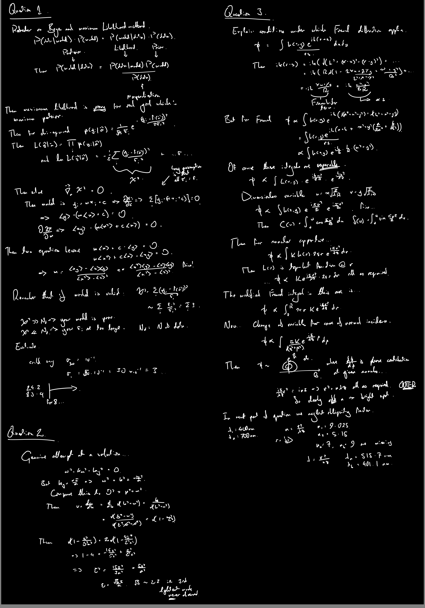
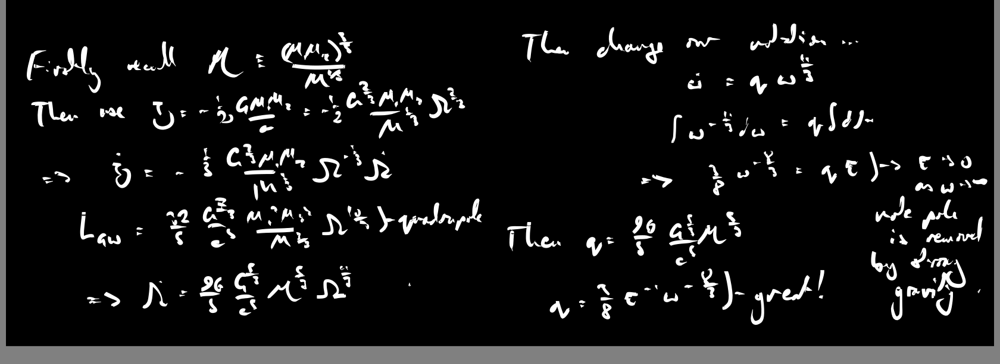
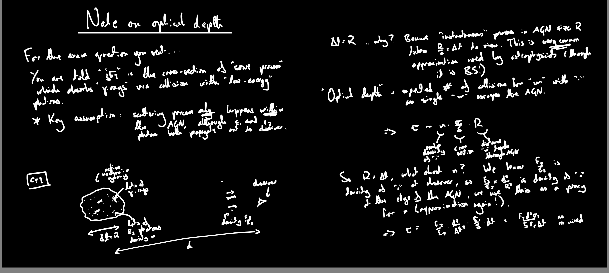

<body class="sph8">

This page is a "clearinghouse" for blackboards and other resources collected from undergraduate teaching, a process which has become much easier since Girton college graciously assisted with the purchase of a <a href="https://www.wacom.com/en-gb">linux-compatible stylus</a> input!

<h2>Oscillations, Waves and Optics</h2>

The "<i>Oscillations, waves and optics</i>" course is an ill-conceived collection of engineering concepts, written for 2nd-year undergraduates. There are two important things which are introduced in disguise, namely <b>hyperbolic systems</b> and <b>dispersion</b>. Both of these ideas play a role in actual physics. The small "<i>Experimental methods</i>" course is taught interstitially with this content: the name speaks for itself.

<h3>Lecture 4 (14:00-16:00 Thursday 3rd November 2022)</h3>

<h3>Lecture 3 (14:00-16:00 Thursday 27th October 2022)</h3>

<h3>Lecture 2 (14:00-16:00 Thursday 20th October 2022)</h3>

Note we did not complete a discussion of the "shunt" modification to ameliorate the low-frequency saturation of the integrator.

<h3>Lecture 1 (14:00-16:00 Thursday 13th October 2022)</h3>

<h3>2022 mock exam</h3>

Two of the questions are copied from Tripos papers, one is sprinkled in for extra seasoning.

 

The blackboard from the post-mock session.

<h2>Methods in Theoretical Physics</h2>

The "<i>Methods</i>" were meant to be a series of informal discussions within the research group during the period where we had some great summer students with us. They tailed off after only a few weeks, but could perhaps be revivified in 2023 if someone wants to contribute content?

<h3>Lecture 4 (Einstein and Jordan frames)</h3>

<h3>Lecture 3 (conformal field thory)</h3>

<h3>Lecture 2 (Virasoro algebra)</h3>

<h3>Lecture 1 (constrained systems)</h3>

<h2>Relativistic Astrophysics and Cosmology</h2>

The "<i>Relativistic astrophysics and cosmology</i>" course is the Physics Department's idea of applied relativity, presented to fourth-year undergraduates. There are some good patches in the course, which was first constructed many years ago, and it is now improving with continued efforts by Dr. Handley.

<h3>Lecture 4</h3>

<h3>Lecture 3</h3>

<h3>Note on the "chirp mass"</h3>

<h3>Note on "optical depth"</h3>

<h2>Mathematics for Natural Sciences</h2>

<i>No curated content for this page yet!</i>

<h2>Particle and Nuclear Physics</h2>

<i>No curated content for this page yet!</i>

<h2>Thermal and Statistical Physics</h2>

<i>No curated content for this page yet!</i>

<h2>Relativity</h2>

<i>No curated content for this page yet!</i>

<h2>Condensed Matter Physics</h2>

<i>No curated content for this page yet!</i>

<h2>Quantum Physics</h2>

<i>No curated content for this page yet!</i>

</body>

