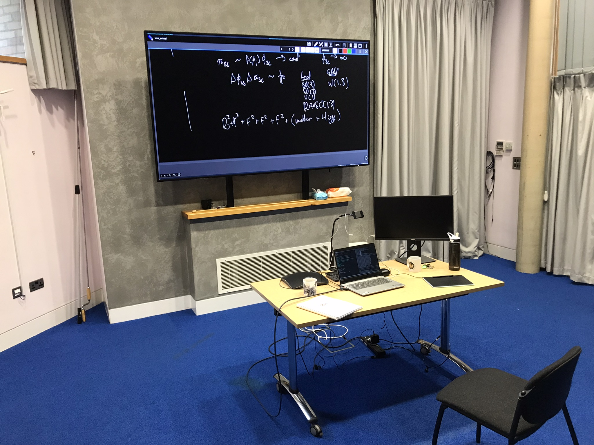
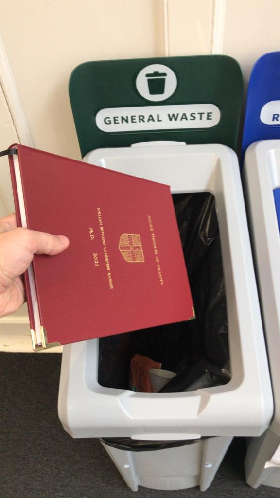

<body class="sph5">

I submitted my thesis on 25/08/2021. If and when it is passed by the Degree Committee for the faculty of Physics and Chemistry, I'll make a full version available here and also leave it on the arXiv. Eventually, a full version should also find its way to the Cambridge University <a href="https://www.repository.cam.ac.uk/">Apollo Repository</a>.

<b>Update:</b> I graduated, and a copy is now on the <a href="https://www.repository.cam.ac.uk/handle/1810/339554">Apollo Repository</a> with DOI <a href="https://doi.org/10.17863/CAM.86972">https://doi.org/10.17863/CAM.86972</a>. I decided there is really no need to have it on the arXiv. 

If you want a PDF, you can <a href="/assets/papers/Barker_PhDThesis.pdf" download><button type="button">download my Ph.D. thesis</button></a>. Be careful, though, because the rigidity theorem states that if you gather enough mathematical errors into a short enough book you will form a black hole: for this reason the thesis is dangerously unstable.

If I can speak <tt>JavaScript</tt>, and your browser supports inline PDFs, you should see a preview below.

 

<h2>
M.Sci. research project
</h2>

In Part III of the NST, there is a baby research project, which I did under Prof. Emilio Artacho at the Cavendish Theory of Condensed Matter Group. I'm afraid I only have a scanned copy of mine due to bit rot.
If you want a PDF, you can <a href="/assets/papers/masters.pdf" download><button type="button">download my MSci project</button></a>

If I can speak <tt>JavaScript</tt>, and your browser supports inline PDFs, you should see a preview below.

 

</body>
